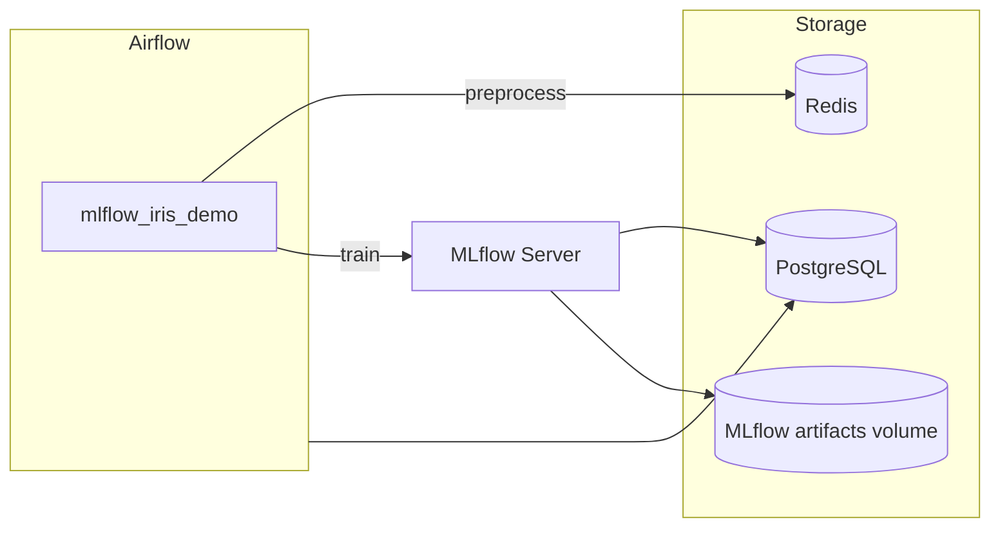

# my_mlflow

Docker-стек для оркестрации ML-пайплайнов: **Apache Airflow** управляет обучением моделей, **MLflow** хранит эксперименты и артефакты, **PostgreSQL** — базой метаданных, **Redis** — промежуточным буфером между задачами.

Демонстрационный DAG `mlflow_iris_demo` обучает `LogisticRegression` на датасете Iris и логирует метрики и модель в MLflow.

## Архитектура



| Сервис | Назначение | UI (по умолчанию) |
|---|---|---|
| Airflow | Оркестрация DAG-ов | http://localhost:8080 |
| MLflow | Трекинг экспериментов | http://localhost:5001 |
| PostgreSQL | Метаданные Airflow и MLflow | localhost:5435 |
| Redis | Передача данных между задачами | localhost:6379 |

## Структура проекта

```
my_mlflow/
├── dags/
│   └── mlflow_iris_demo.py
├── docker-compose.yml
├── Dockerfile
├── .env.example
├── Makefile
├── make.ps1
├── make.cmd
├── .gitlab-ci.yml
└── README.md
```

## Быстрый старт

### Требования

- Docker и Docker Compose v2
- `make` (Git Bash, WSL или `choco install make`)

### Запуск

```bash
cp .env.example .env

docker compose up -d --build
make restart
```

После старта:

- **Airflow UI** — http://localhost:8080 (логин/пароль из `.env`)
- **MLflow UI** — http://localhost:5001

Включите DAG `mlflow_iris_demo` в Airflow и запустите вручную (schedule отключён).

### Остановка

```bash
docker compose down
```

## Переменные окружения

Секреты и хост-порты вынесены в `.env`. Шаблон — `.env.example`.

| Группа | Переменные |
|---|---|
| PostgreSQL | `POSTGRES_USER`, `POSTGRES_PASSWORD`, `POSTGRES_DB`, `POSTGRES_HOST_PORT` |
| Redis | `REDIS_HOST_PORT` |
| MLflow | `MLFLOW_HOST_PORT` |
| Airflow | `AIRFLOW_WEBSERVER_HOST_PORT`, `AIRFLOW_ADMIN_USERNAME`, `AIRFLOW_ADMIN_PASSWORD`, `AIRFLOW_ADMIN_EMAIL` |

Файл `.env` не коммитится в git.

## Makefile

| Команда | Описание |
|---|---|
| `make restart` | Пересобрать и перезапустить весь стек |
| `make push MSG="текст"` | `git add` → `commit` → `push` в текущую ветку |

## CI/CD

Pipeline в `.gitlab-ci.yml` запускается при merge request и push в `main`.

| Stage | Job | Действие |
|---|---|---|
| validate | `validate:compose` | Проверка `docker-compose.yml` |
| validate | `validate:dags` | Проверка синтаксиса DAG-файлов |
| deploy | `deploy` | SSH-деплой на сервер (`git pull` + `docker compose up`), ручной запуск |

Переменные GitLab CI/CD (`Settings → CI/CD → Variables`):

- `SSH_PRIVATE_KEY`
- `DEPLOY_HOST`
- `DEPLOY_USER`
- `DEPLOY_PATH`

## Демо-пайплайн

DAG `mlflow_iris_demo` состоит из двух задач:

1. **preprocess** — загружает Iris, делит на train/test, сохраняет в Redis
2. **train** — читает данные из Redis, обучает `LogisticRegression`, логирует accuracy и модель в MLflow

Результаты эксперимента доступны в MLflow UI (эксперимент `iris_demo`).

## Стек технологий

- Apache Airflow 2.8.1
- MLflow 2.14.1
- scikit-learn 1.3.2
- PostgreSQL 17
- Redis 7
- GitLab CI/CD
