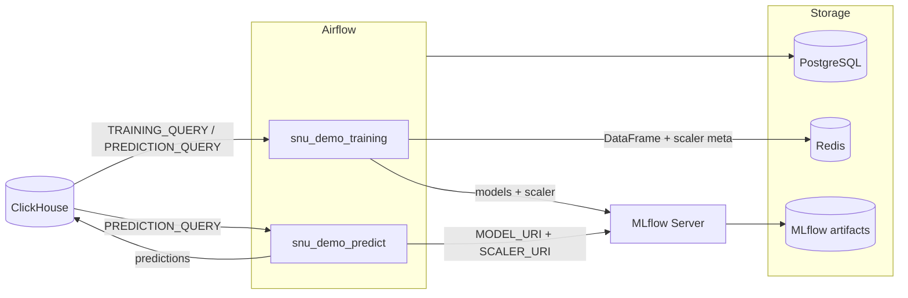

# my-mlflow

Docker-стек для оркестрации ML-пайплайнов: **Apache Airflow** управляет обучением и инференсом, **MLflow** хранит эксперименты и артефакты, **PostgreSQL** — метаданные Airflow, **Redis** — буфер между задачами, **ClickHouse** (внешний) — источник телеметрии и приёмник предсказаний.

**Данные внешние:** этот репозиторий не поднимает БД с датасетом и не создаёт исходные таблицы. Обучение и инференс читают уже существующие **внешние таблицы** ClickHouse. Схема `snu` и таблицы `telemetry_*` — **только пример** (демо скважин SNU); в проде подставляются любые таблицы через `TRAINING_QUERY` / `PREDICTION_QUERY`. DDL и данные — в отдельном проекте `Clickhouse/`.

Демо-DAG-и:

| DAG | Файл | Назначение |
|---|---|---|
| `snu_demo_training` | `dags/dag_1.py` | Обучение (regression / classification по `PREDICTION_TYPE`) |
| `snu_demo_predict` | `dags/dag_2.py` | Инференс → запись в таблицу предсказаний ClickHouse |

## Архитектура



| Сервис | Назначение | UI (по умолчанию) |
|---|---|---|
| Airflow | Оркестрация DAG-ов | http://localhost:8080 |
| MLflow | Трекинг экспериментов | http://localhost:5001 |
| PostgreSQL | Метаданные Airflow | localhost:5435 |
| Redis | Передача DataFrame между задачами | localhost:6379 |

ClickHouse — **внешний** контейнер в сети `clickhouse_default` (не поднимается этим compose). Обычно рядом лежит проект `Clickhouse/` (`mem_limit` ~5g и т.п.). Таблицы с данными тоже внешние: compose только подключается к уже заполненному ClickHouse.

## Структура проекта

```
my-mlflow/
├── dags/
│   ├── dag_1.py              # snu_demo_training
│   └── dag_2.py              # snu_demo_predict
├── scripts/
│   ├── engines.py            # Redis / ClickHouse helpers
│   ├── settings.py           # реестр sklearn + сборка из Variables
│   ├── train.py              # обучение + MLflow metrics
│   ├── scaling.py            # Standard / MinMax / Robust / none
│   └── variables.py          # init Airflow Variables (airflow-init)
├── queries/                  # опциональные SQL (mount в контейнер)
├── docker-compose.yml
├── Dockerfile
├── .env.example
├── Makefile
└── README.md
```

SQL таблиц и материализованных VIEW — во внешнем `Clickhouse/`, например:

```
Clickhouse/
├── docker-compose.yml
├── config.d/memory.xml
├── tables/
│   ├── snu_telemetry.sql
│   ├── snu_telemetry_comments.sql
│   ├── external_weather.sql
│   └── external_power.sql
└── views/
    └── telemetry_2.sql       # train/pred MV с Label Encoding (UInt8)
```

Регенерация синтетики: `scripts/regen_snu_telemetry.sql` (в этом репо) при необходимости.

## Данные ClickHouse (схема `snu`)

Все таблицы ниже — **внешние**: DAG-и только `SELECT` / `INSERT` по именам из Airflow Variables. Схему, MV и наполнение данными этот стек не создаёт.

**Telemetry — только пример.** Таблицы `snu.snu_telemetry`, `snu.telemetry_*` и MV из `telemetry_2.sql` показывают, как подключить внешний датасет. Стек не привязан к телеметрии скважин: достаточно сменить SQL в Variables.

Исходная телеметрия (демо): `snu.snu_telemetry` — секундные ряды, скважины `SNU-001`…`SNU-005`, категориальные поля как **Enum8** (норма / `none` = 0), таргеты следующего шага: `target_oil_mixture_next_m3`, `target_aggregate_temp_next_c`, `target_scenario_next`, `target_anomaly_type_next`.

Актуальные MV из `telemetry_2.sql` (Label Encoding через `toUInt8`, `well_id = SNU-001`):

| Объект | Роль |
|---|---|
| `snu.telemetry_aggregate_temp_c` | Train MV регрессии (`ts <= 2026-08-06`), колонка **`target`** = след. температура |
| `snu.telemetry_aggregate_temp_c_pred` | Pred features (`ts > 2026-08-06`, есть `ts`, без `target`) |
| `snu.telemetry_scenario` | Train MV сценария (`target_scenario_next` как UInt8-таргет при необходимости) |
| `snu.telemetry_scenario_pred` | Pred features для сценария |
| `snu.telemetry_aggregate_temp_c_3600_prediction` | Таблица результата predict (имя по Variable) |
| `snu.external_weather` / `snu.external_power` | Внешние факторы |

Набор колонок в `TRAINING_QUERY` (с `target`) и `PREDICTION_QUERY` (с `ts`, без `target`) должен совпадать по фичам. После обучения Variable `FEATURE_COLS` фиксирует порядок колонок для predict.

## Быстрый старт

### Требования

- Docker и Docker Compose v2
- Внешний ClickHouse в сети `clickhouse_default` с уже существующими таблицами данных (для демо — схема `snu` и MV из `telemetry_2.sql`; telemetry здесь только пример)

### Запуск

Одна команда:

```bash
make
```

При первом запуске Makefile копирует `.env.example` → `.env` (если файла ещё нет), собирает образы и поднимает стек. Секреты и порты при необходимости правьте в `.env`, затем снова `make`.

После старта:

- **Airflow** — http://localhost:8080 (логин/пароль из `.env`)
- **MLflow** — http://localhost:5001

Variables инициализируются скриптом `scripts/variables.py` (вызывается из `airflow-init`).  
Включите DAG в UI и запускайте вручную (`schedule=None`).

Повторно применить Variables:

```bash
docker exec my-mlflow-airflow-webserver-1 python /opt/airflow/scripts/variables.py
```

### Остановка

```bash
make down
```

Если после перезапуска Docker UI MLflow не открывается с хоста (`Empty reply`), а внутри контейнера сервис жив — `make restart`.

## Переменные окружения

Секреты и хост-порты — в `.env` (шаблон `.env.example`). Файл `.env` не коммитится.

| Группа | Переменные |
|---|---|
| PostgreSQL | `POSTGRES_USER`, `POSTGRES_PASSWORD`, `POSTGRES_DB`, `POSTGRES_HOST_PORT` |
| Redis | `REDIS_HOST_PORT` |
| MLflow | `MLFLOW_HOST_PORT` |
| Airflow | `AIRFLOW_WEBSERVER_HOST_PORT`, `AIRFLOW_ADMIN_*` |
| ClickHouse (внешний) | `CLICKHOUSE_HOST`, `CLICKHOUSE_PORT`, `CLICKHOUSE_USER`, `CLICKHOUSE_PASSWORD`, `CLICKHOUSE_DB` |

Connection id ClickHouse: `clickhouse_default` (через `AIRFLOW_CONN_CLICKHOUSE_DEFAULT`).

## Airflow Variables

Источник дефолтов: `scripts/variables.py`.

| Variable | Назначение |
|---|---|
| `MLFLOW_EXPERIMENT_NAME` | Эксперимент MLflow (`mlflow_test_snu`) |
| `DATASET_NAME` | Имя датасета в MLflow input |
| `PREDICTION_TYPE` | `regression` или `classification` — выбор реестра моделей |
| `TRAIN_SPLIT` | Доля train (`0.8`), split по времени после сортировки |
| `TRAINING_QUERY` | SQL фич + **`target`** для `snu_demo_training` |
| `PREDICTION_QUERY` | SQL фич + **`ts`**, без `target` |
| `PREDICTION_TABLE` | Куда писать результат |
| `MODEL_URI` | URI модели, например `runs:/<run_id>/DecisionTreeRegressor` |
| `SCALER_TYPE` | `none` / `standard` / `minmax` / `robust` |
| `SCALER_EXCLUDE_COLS` | CSV колонок без scale (по умолчанию `scenario,anomaly_flag,anomaly_type`) |
| `SCALER_URI` | URI scaler в MLflow (ставится автоматически после training) |
| `SCALER_SCALED_COLS` | Колонки, к которым применён scaler (авто) |
| `FEATURE_COLS` | Порядок фич после training (авто, для predict) |
| `REGRESSION_MODELS` | JSON: имя → kwargs sklearn |
| `CLASSIFICATION_MODELS` | JSON: имя → kwargs sklearn |

**Важно про объём:** `SELECT *` по полной MV (~миллионы строк) может оборвать Redis (`Connection reset`). Для демо добавляйте sampling / фильтр по дню в `TRAINING_QUERY`, например `WHERE ts_day_year = 218` или `cityHash64(...) % 50 = 0`.

После обучения:

1. В MLflow возьмите URI лучшей модели → `MODEL_URI`
2. `SCALER_URI` / `FEATURE_COLS` уже выставлены training-DAG (если был scaler)

## Демо-пайплайны

### `snu_demo_training`

1. **data** — `TRAINING_QUERY` → Redis `training_df:data`  
2. **preprocessing** — сортировка по календарным полям → **train/test split** → scaling (**fit только на train**) → Redis `train` / `test` / `scaler_meta`  
3. **training** — модели из `REGRESSION_MODELS` или `CLASSIFICATION_MODELS`, nested runs; лог scaler в MLflow (`artifact_path=scaler`); обновление `SCALER_URI`, `SCALER_SCALED_COLS`, `FEATURE_COLS`

Категориальные label-encoded колонки по умолчанию **не** масштабируются (`SCALER_EXCLUDE_COLS`).

Пример `REGRESSION_MODELS`:

```json
{
  "LinearRegression": {},
  "DecisionTreeRegressor": {"max_depth": 8, "random_state": 42},
  "RandomForestRegressor": {"n_estimators": 30, "max_depth": 8, "n_jobs": 2, "random_state": 42},
  "GradientBoostingRegressor": {"n_estimators": 30, "max_depth": 3, "random_state": 42}
}
```

Чтобы отключить модель — уберите ключ из JSON. Новый тип — сначала в реестр `scripts/settings.py`.

### `snu_demo_predict`

1. **data** — `PREDICTION_QUERY` → Redis (`ts` отдельно от фич)  
2. **predict** — выравнивание по `FEATURE_COLS` → `transform` через `SCALER_URI` (если не `none`) → `model.predict(MODEL_URI)`  
3. **truncate** — `TRUNCATE TABLE IF EXISTS {{ PREDICTION_TABLE }}`  
4. **output** — insert (`ts`, `target`=prediction, `update_time`) + лог в MLflow  

Таблица результата: обычно `ReplacingMergeTree(update_time)` с колонками `ts`, `target` (Float32), `update_time`.

## Makefile

| Команда | Описание |
|---|---|
| `make` / `make up` | создать `.env` при отсутствии → `up -d --build` |
| `make down` | остановить и удалить контейнеры |
| `make restart` | `down` → `up -d --build` |
| `make restart_prune` | то же + `docker system prune -a` |
| `make push MSG="текст"` | `git add` → `commit` → `push` |

## Стек технологий

- Apache Airflow 2.8.1
- MLflow 2.14.1
- scikit-learn 1.3.2
- PostgreSQL 17
- Redis 7
- ClickHouse (внешний, `clickhouse-driver` / `airflow-clickhouse-plugin`)
