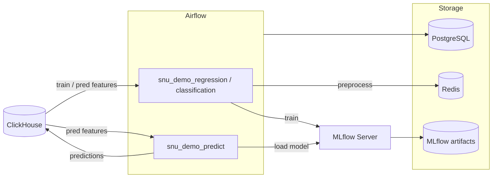

# my-mlflow

Docker-стек для оркестрации ML-пайплайнов: **Apache Airflow** управляет обучением и инференсом, **MLflow** хранит эксперименты и артефакты, **PostgreSQL** — метаданные Airflow, **Redis** — буфер между задачами, **ClickHouse** (внешний) — источник телеметрии и приёмник предсказаний.

Демо-DAG-и:

| DAG | Назначение |
|---|---|
| `snu_demo_regression` | Обучение регрессии температуры (`aggregate_temp_c`) |
| `snu_demo_classification` | Обучение классификации аномалий |
| `snu_demo_predict` | Инференс → запись в таблицу предсказаний ClickHouse |

## Архитектура



| Сервис | Назначение | UI (по умолчанию) |
|---|---|---|
| Airflow | Оркестрация DAG-ов | http://localhost:8080 |
| MLflow | Трекинг экспериментов | http://localhost:5001 |
| PostgreSQL | Метаданные Airflow | localhost:5435 |
| Redis | Передача DataFrame между задачами | localhost:6379 |

ClickHouse — **внешний** контейнер в сети `clickhouse_default` (не поднимается этим compose). Обычно рядом лежит отдельный проект `Clickhouse/` с `docker-compose.yml` (`mem_limit: 10g` и т.п.).

## Структура проекта

```
my-mlflow/
├── dags/
│   ├── dag_1.py              # snu_demo_regression
│   ├── dag_2.py              # snu_demo_classification
│   └── dag_3.py              # snu_demo_predict
├── scripts/
│   ├── engines.py            # Redis / ClickHouse helpers
│   ├── settings.py           # реестр sklearn + сборка из Variables
│   └── train.py              # обучение + MLflow logging
├── queries/                  # опциональные SQL-файлы (mount в контейнер)
├── docker-compose.yml
├── Dockerfile
├── .env.example
├── Makefile / make.ps1 / make.cmd
├── .gitlab-ci.yml
└── README.md
```

SQL материализованных VIEW и таблиц внешних факторов живёт во внешнем репозитории/папке ClickHouse, например:

```
Clickhouse/
├── docker-compose.yml
├── config.d/memory.xml
├── tables/
│   ├── external_weather.sql
│   └── external_power.sql
└── views/
    ├── telemetry_aggregate_temp_c_3600.sql
    ├── telemetry_aggregate_temp_c_3600_pred.sql
    ├── telemetry_anomaly_3600.sql
    └── telemetry_anomaly_3600_pred.sql
```

## Данные ClickHouse (схема `snu`)

Исходная телеметрия: `snu.snu_telemetry` (в т.ч. `well_id`, секундные ряды).

| Объект | Роль |
|---|---|
| `snu.telemetry_aggregate_temp_c_3600` | Train MV регрессии (SNU-001, `ts <= 2026-08-06`) |
| `snu.telemetry_aggregate_temp_c_3600_pred` | Features для инференса (`ts > 2026-08-06`, без `target`) |
| `snu.telemetry_anomaly_3600` | Train MV классификации |
| `snu.telemetry_anomaly_3600_pred` | Pred MV классификации |
| `snu.telemetry_aggregate_temp_c_3600_prediction` | Результат predict (регрессия) |
| `snu.telemetry_aggregate_anomaly_3600_prediction` | Результат predict (классификация) |
| `snu.external_weather` / `snu.external_power` | Внешние факторы (погода / электросеть) |

Типичные фичи train/pred (регрессия): календарные поля из `ts`, `aggregate_temp_c_lag`, `is_anomaly_1` / `is_anomaly_2`, `aggregate_temp_diff`; опционально лаги объёма/тока и погода — через Airflow Variables (см. ниже). Набор колонок в `REGRESSION_QUERY` и `PREDICTION_QUERY` **должен совпадать** (кроме `target` / `ts`).

## Быстрый старт

### Требования

- Docker и Docker Compose v2
- Внешний ClickHouse в сети `clickhouse_default`, схема `snu`, VIEW `*_3600` / `*_pred`
- На Windows: `.\make restart` (обёртки `make.ps1` / `make.cmd`)

### Запуск

```bash
cp .env.example .env
# отредактируйте секреты и порты в .env

.\make restart
# или: docker compose up -d --build
```

После старта:

- **Airflow** — http://localhost:8080 (логин/пароль из `.env`)
- **MLflow** — http://localhost:5001

Включите нужные DAG в UI и запускайте вручную (`schedule=None`).

### Остановка

```bash
docker compose down
```

Если после перезапуска WSL/Docker UI MLflow не открывается с хоста (`Empty reply`), а внутри контейнера сервис жив — перезапустите сервис: `docker compose restart mlflow`.

## Переменные окружения

Секреты и хост-порты — в `.env` (шаблон `.env.example`). Файл `.env` не коммитится.

| Группа | Переменные |
|---|---|
| PostgreSQL | `POSTGRES_USER`, `POSTGRES_PASSWORD`, `POSTGRES_DB`, `POSTGRES_HOST_PORT` |
| Redis | `REDIS_HOST_PORT` |
| MLflow | `MLFLOW_HOST_PORT` |
| Airflow | `AIRFLOW_WEBSERVER_HOST_PORT`, `AIRFLOW_ADMIN_*` |
| ClickHouse (внешний) | `CLICKHOUSE_HOST`, `CLICKHOUSE_PORT`, `CLICKHOUSE_USER`, `CLICKHOUSE_PASSWORD`, `CLICKHOUSE_DB` |

Connection id ClickHouse: `clickhouse_default` (через `AIRFLOW_CONN_CLICKHOUSE_DEFAULT`).

## Airflow Variables

Задаются при `airflow-init` (значения по умолчанию в `docker-compose.yml`) и правятся в UI / CLI.

| Variable | Назначение |
|---|---|
| `MLFLOW_EXPERIMENT_NAME` | Эксперимент MLflow (по умолчанию `mlflow_test_snu`) |
| `TRAIN_SPLIT` | Доля train (по умолчанию `0.8`), split по времени после сортировки |
| `REGRESSION_QUERY` | SQL фич + `target` для `snu_demo_regression` |
| `CLASSIFICATION_QUERY` | SQL фич + `target` для `snu_demo_classification` |
| `PREDICTION_QUERY` | SQL фич (+ `ts`) для `snu_demo_predict`, **без** `target` |
| `PREDICTION_TABLE` | Куда писать результат (например `snu.telemetry_aggregate_temp_c_3600_prediction`) |
| `PREDICTION_TYPE` | Метка для логов (`regression` / `classification`) |
| `MODEL_URI` | URI модели MLflow, например `runs:/<run_id>/DecisionTreeRegressor` |
| `REGRESSION_MODELS` | JSON: имя модели → kwargs sklearn для `snu_demo_regression` |
| `CLASSIFICATION_MODELS` | JSON: имя модели → kwargs sklearn для `snu_demo_classification` |

После обучения возьмите URI из MLflow UI и обновите `MODEL_URI`. Если в pred-запросе есть колонки, которых не было при fit, задача `predict` упадёт с `feature names should match`.

Дефолты при init (можно расширять под MV с лагами/погодой):

```text
REGRESSION_QUERY:
  … is_anomaly_1, is_anomaly_2, aggregate_temp_diff, target
  FROM snu.telemetry_aggregate_temp_c_3600

CLASSIFICATION_QUERY:
  … is_anomaly, aggregate_temp_diff, target
  FROM snu.telemetry_anomaly_3600

PREDICTION_QUERY:
  ts, … is_anomaly_1, is_anomaly_2, aggregate_temp_diff
  FROM snu.telemetry_aggregate_temp_c_3600_pred
```

## Демо-пайплайны

### `snu_demo_regression` / `snu_demo_classification`

1. **data** — `ClickHouseHook` выполняет Variable-запрос → DataFrame в Redis  
2. **preprocessing** — сортировка по календарным полям, train/test split, `X`/`y` → Redis  
3. **training** — модели из Variables `REGRESSION_MODELS` / `CLASSIFICATION_MODELS` (реестр классов в `scripts/settings.py`), nested runs в MLflow

Пример `REGRESSION_MODELS`:

```json
{
  "LinearRegression": {},
  "DecisionTreeRegressor": {"max_depth": 8, "random_state": 42},
  "RandomForestRegressor": {"n_estimators": 30, "max_depth": 8, "n_jobs": 2, "random_state": 42},
  "GradientBoostingRegressor": {"n_estimators": 30, "max_depth": 3, "random_state": 42}
}
```

Чтобы отключить модель — уберите ключ из JSON. Новый тип модели сначала добавляется в реестр в `settings.py`.

### `snu_demo_predict`

1. **data** — `PREDICTION_QUERY` → Redis (`ts` отдельно от фич)  
2. **predict** — `mlflow.sklearn.load_model(MODEL_URI)` → `y_pred`  
3. **truncate** — `ClickHouseOperator`: `TRUNCATE TABLE IF EXISTS {{ PREDICTION_TABLE }}`  
4. **output** — insert (`ts`, `target`=prediction, `update_time`) + лог в MLflow  

Таблица результата: `ReplacingMergeTree(update_time)` с колонками `ts`, `target` (Float32), `update_time`.

## Makefile

| Команда | Описание |
|---|---|
| `make restart` / `.\make restart` | `down` → `up -d --build` |
| `make restart_prune` | то же + `docker system prune -a` |
| `make push MSG="текст"` | `git add` → `commit` → `push` |

## CI/CD

Pipeline в `.gitlab-ci.yml` — при merge request и push в `main`.

| Stage | Job | Действие |
|---|---|---|
| validate | `validate:compose` | Проверка `docker-compose.yml` |
| validate | `validate:dags` | Синтаксис DAG-файлов |
| deploy | `deploy` | SSH-деплой (`git pull` + `compose up`), вручную |

Переменные GitLab CI/CD: `SSH_PRIVATE_KEY`, `DEPLOY_HOST`, `DEPLOY_USER`, `DEPLOY_PATH`.

## Стек технологий

- Apache Airflow 2.8.1
- MLflow 2.14.1
- scikit-learn 1.3.2
- PostgreSQL 17
- Redis 7
- ClickHouse (внешний, `clickhouse-driver` / `airflow-clickhouse-plugin`)
- GitLab CI/CD
