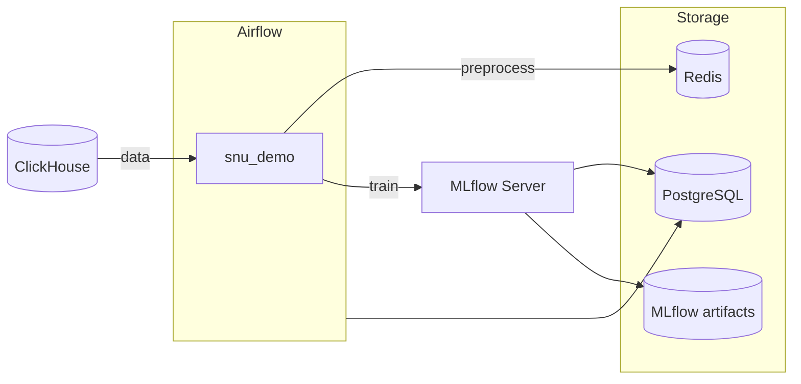

# my-mlflow

Docker-стек для оркестрации ML-пайплайнов: **Apache Airflow** управляет обучением, **MLflow** хранит эксперименты и артефакты, **PostgreSQL** — метаданные, **Redis** — буфер между задачами.

Демонстрационные DAG-и читают VIEW `snu.telemetry_aggregate_temp_c` (регрессия) и `snu.telemetry_anomaly` (классификация), обучают модели и логируют результаты в MLflow.

## Архитектура



| Сервис | Назначение | UI (по умолчанию) |
|---|---|---|
| Airflow | Оркестрация DAG-ов | http://localhost:8080 |
| MLflow | Трекинг экспериментов | http://localhost:5001 |
| PostgreSQL | Метаданные Airflow и MLflow | localhost:5435 |
| Redis | Передача данных между задачами | localhost:6379 |

ClickHouse — **внешний** контейнер в сети `clickhouse_default` (не поднимается этим compose).

## Структура проекта

```
my-mlflow/
├── dags/
│   ├── dag_1.py              # snu_demo_regression
│   └── dag_2.py              # snu_demo_classification
├── scripts/
│   ├── engines.py            # Redis / ClickHouse helpers
│   ├── settings.py           # модели sklearn
│   ├── queries.py            # SQL к ClickHouse
│   └── train.py              # обучение + MLflow logging
├── docker-compose.yml
├── Dockerfile
├── .env.example
├── Makefile / make.ps1 / make.cmd
├── .gitlab-ci.yml
└── README.md
```

## Быстрый старт

### Требования

- Docker и Docker Compose v2
- Внешний ClickHouse в сети `clickhouse_default` (БД/VIEW `snu.telemetry_aggregate_temp_c`)
- На Windows: `.\make restart` (обёртки `make.ps1` / `make.cmd`)

### Запуск

```bash
cp .env.example .env
# отредактируйте секреты и порты в .env

.\make restart
# или: docker compose up -d --build
```

После старта:

- **Airflow** — http://localhost:8080 (логин/пароль из `.env`)
- **MLflow** — http://localhost:5001

Включите DAG `snu_demo_regression` / `snu_demo_classification` в Airflow и запустите вручную (schedule отключён).

### Остановка

```bash
docker compose down
```

## Переменные окружения

Секреты и хост-порты — в `.env` (шаблон `.env.example`). Файл `.env` не коммитится.

| Группа | Переменные |
|---|---|
| PostgreSQL | `POSTGRES_USER`, `POSTGRES_PASSWORD`, `POSTGRES_DB`, `POSTGRES_HOST_PORT` |
| Redis | `REDIS_HOST_PORT` |
| MLflow | `MLFLOW_HOST_PORT` |
| Airflow | `AIRFLOW_WEBSERVER_HOST_PORT`, `AIRFLOW_ADMIN_*` |
| ClickHouse (внешний) | `CLICKHOUSE_HOST`, `CLICKHOUSE_PORT`, `CLICKHOUSE_USER`, `CLICKHOUSE_PASSWORD`, `CLICKHOUSE_DB` |

## Makefile

| Команда | Описание |
|---|---|
| `make restart` / `.\make restart` | `down` → `up -d --build` |
| `make restart_prune` | то же + `docker system prune -a` |
| `make push MSG="текст"` | `git add` → `commit` → `push` |

## CI/CD

Pipeline в `.gitlab-ci.yml` — при merge request и push в `main`.

| Stage | Job | Действие |
|---|---|---|
| validate | `validate:compose` | Проверка `docker-compose.yml` |
| validate | `validate:dags` | Синтаксис DAG-файлов |
| deploy | `deploy` | SSH-деплой (`git pull` + `compose up`), вручную |

Переменные GitLab CI/CD: `SSH_PRIVATE_KEY`, `DEPLOY_HOST`, `DEPLOY_USER`, `DEPLOY_PATH`.

## Демо-пайплайн (`snu_demo`)

Задачи:

1. **data** — `ClickHouseHook` читает `snu.telemetry_aggregate_temp_c`, кладёт DataFrame в Redis  
2. **preprocessing** — train/test split, фичи/таргет `aggregate_temp_c` → Redis  
3. **training** — обучает модели из `scripts/settings.py`, логирует params/metrics/model в эксперимент `mlflow_test_snu`

Connection id: `clickhouse_default` (через `AIRFLOW_CONN_CLICKHOUSE_DEFAULT`).

```python
from airflow_clickhouse_plugin.hooks.clickhouse import ClickHouseHook

ch = ClickHouseHook(clickhouse_conn_id="clickhouse_default")
rows = ch.execute("SELECT count() FROM snu.telemetry_aggregate_temp_c")
```

## Стек технологий

- Apache Airflow 2.8.1
- MLflow 2.14.1
- scikit-learn 1.3.2
- PostgreSQL 17
- Redis 7
- ClickHouse (внешний, `clickhouse-driver`)
- GitLab CI/CD
